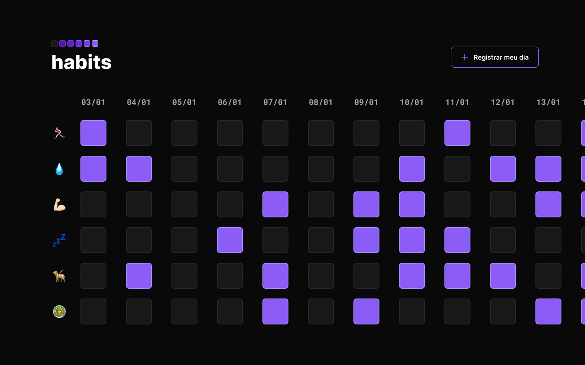

<h1 align="center"> Habits </h1>

  

## 💻 Projeto 
O Habits é um app para ajudar a rastrear os hábitos.

- [Visite o projeto online](https://leticiakax.github.io/nlw-setup)

## 🚀 Tecnologias
Esse projeto foi desenvolvido durante o NLW da Rocketseat com as seguintes tecnologias: 
- HTML
- CSS
- Javascript
- Git e Github
- Figma 

## 🏷 Layout
Você pode visualizar o layout do projeto através [desse link](https://www.figma.com/file/HHlEdjyY3iCaeYhoA60WxG/Habits?type=design&node-id=75%3A128&t=RhJqxAFPixxgVtvJ-1). 
É necessário ter uma conta no [Figma](https://www.figma.com).